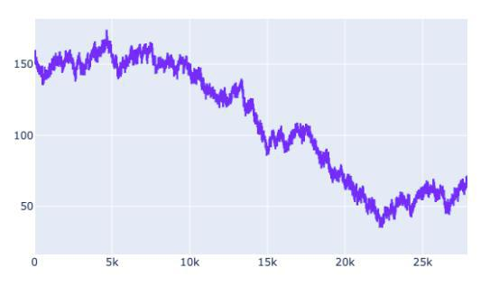
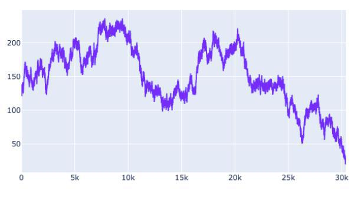
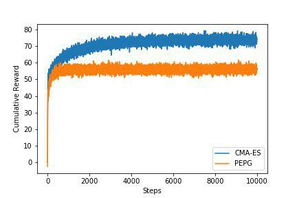
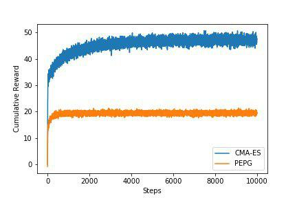

# Reinforcement Learning (CSE564) Project

Adapted from Ha and Schmidhuber, "World Models", 2018. Refer [original project page](https://ctallec.github.io/world-models/).

## Introduction

We extend the Model Based World Model RL algorithm by updating in the following specifics:
- Use a vanilla autoencoder for the vision (V) model. The authors mention that they use a variational autoencoder to constrain and impose a gaussian distribution over the sampled state latents. We hypothesise that removing the gaussian constraint might work better since we do not constrict the state latents to a distribution.
- Use the [PEPG (Parameter Exploring Policy Gradients) evolutionary algorithm](http://citeseerx.ist.psu.edu/viewdoc/download;jsessionid=A64D1AE8313A364B814998E9E245B40A?doi=10.1.1.180.7104&rep=rep1&type=pdf) to converge to the global maxima. A particular weakness of the CMA-ES method is that it discards the majority of the solutions in one generation, and keeps only the top n% of solutions. Weak solutions might contain information too that might help in the convergence. Refer [this blog](http://blog.otoro.net/2017/10/29/visual-evolution-strategies/) for a concise explanation

## Running models

- To train the autoencoder and variational autoencoder, run the trainvae.py and trainae.py scripts.

  - ```python trainvae.py --log_dir <directory>```

  - ```python trainae.py --log_dir <directory>```

- To train MDN-RNN network using autoencoder and MDN-RNN using variational autoencoder, run the trainmdrnn.py and trainmdrnn_ae.py

  - ```python trainmdrnn.py --log_dir <directory>```

  - ```python trainmdrnn_ae.py --log_dir <directory>```

- To train the controller network using CMA-ES/PEPG with VAE/AE forward passes, train the corresponding files from: 
traincontroller_cmaes_ae.py, traincontroller_cmaes_vae.py, traincontroller_pepg_ae.py, traincontroller_pepg_vae.py

  - ```python traincontroller_cmaes_ae.py --log_dir <directory> --n-samples <no. of samples> --pop-size <no. of threads> --target-return <expected cumulative reward> --display```

  - ```python traincontroller_cmaes_vae.py --log_dir <directory> --n-samples <no. of samples> --pop-size <no. of threads> --target-return <expected cumulative reward> --display```

  - ```python traincontroller_pepg_ae.py --log_dir <directory> --n-samples <no. of samples> --pop-size <no. of threads> --target-return <expected cumulative reward> --display```

  - ```python traincontroller_pepg_vae.py --log_dir <directory> --n-samples <no. of samples> --pop-size <no. of threads> --target-return <expected cumulative reward> --display```

## Analysis

VAE Training Loss:

<p align="center">
  
</p>

AE Training Loss:
<p align="center">
  
</p>

Cumulative sum reward with VAE latents:
<p align="center">
  
</p>

Cumulative sum reward with AE latents:
<p align="center">
  
</p>

## Results

We evaluate the results by measuring the cumulative rewards obtained over the test trajectories.

Encoder Model/Parameter Search Method | Covariance Matrix Adaptation Evolution Strategy (CMA-ES) | Parameter-Exploring Policy Gradients (PEPG)
------------ | ------------- | -------------
Variational Autoencoder | 74.67 +/- 10.12 | 60.94 +/- 6.17 
 Vanilla Autoencoder | 47.34 +/- 6.37 | 20.36 +/- 3.80


Note: Code adapted from [here](https://github.com/ctallec/world-models)
